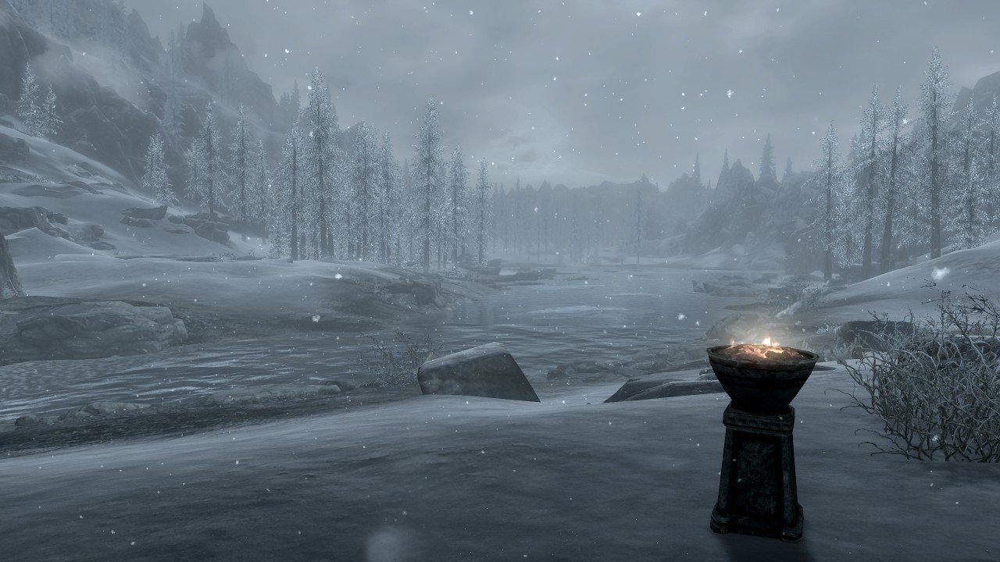

  

# Undaunted
SkyrimSE Mod for Dynamic Quest/bounties.
Inspired by the ESO Guild The Undaunted and the Diablo 3 Adventure mode.

https://youtu.be/3igoZVReoZE

## Requirements
* SKSE SE build 2.0.17 (runtime 1.5.97)
* JContainers (Currently bundled with the release)

## How to play

1. Visit the Undaunted Camp northwest of Windhelm.
2. Use the Pillar to get the Start Undaunted Bounty.
3. Anywhere you want use the Start Undaunted Bounty power
4. A Quest will start called Undaunted.
5. Somewhere nearby a quest marker will appear pointing to where the bounty starts
6. Go to the marker, once you are in range the event will begin.
7. Complete the event and another event will appear nearby.
8. Complete 3 events to be rewarded an Undaunted Key.
9. Start another event chain or return to the Undaunted Camp and trade your Keys for scaled weapons and armour from any loaded mod.

## Spawning Groups

* Simple Oblivion Gate
* 8 different bandit encounters 
* 3 vampire encounters
* 6 Draugr encounters
* 3 Falmer encounters
* 1 Forsworn encounter
* 3 Undead encounters 

## How it works

I wanted to see if I could dynamically create quest content without having to place thousand of markers over skyrim.
When the bounty is started the SKSE Plugin loads the Region data and grabs all the worldspaces and the unk088 cells which appears to contain all the persistant references in the worldspace.

It then filters these down by Worldspace name as most of the worldspaces are one off quest spaces.

Next it selects a random persistant reference and moves an XMarker to that location. The XMarker is the objective of the Quest and it's used as the target of the placeatme calls.

Finally any of the enemies created are stored in memory in the plugin and checked every 20 seconds to see if they are dead. If they are the objective is marked as completed.

As the mod is using the Region data from memory any mods which add these would also be accessable from this mod. Currently the code checks what worldspace you are in when you start a bounty and spawns it there.

## What the mod can do

* Dynamically place forms in any Cell in any Worldspace. Skyrim's main world has roughly 18,000 different places this mod can spawn.
* Code for placing in Interior cells also exists, but currently isn't used to stop bandit raids of Belethor's General Goods.
* Json Configuration for bounty groups. References via mod name and base formid meaning any mod is supported.
* Quest tracking for dynamically placed enemies with dynamic objective text.
* Script based objectives allowing custom objectives.
* Very mod compatible, currently only adds 4 items to the world. (2 markers, 2 activators)
* Support for Mod created enemies that aren't placed into the default leveled lists via a Mod name + base form lookup.
* Currently supports 7 Spawn types: Enemy, BountyDecoration, SpawnEffect, EndEffect,PhysicsScripted,Scripted and Ally
* Rewards bounties with a random piece of Armour or Weapon from any loaded mod. Checks gameplay values against current level to balance this so level 10 players will get up to level 10 gear etc

## Known issues/WIP
* Bounty tracking doesn't persist between sessions. Meaning you can only complete a bounty in the session you started it.
* More advanced encounters. This system is able to spawn objects with scripts attached to them.

## Credits

* LordKarnak for The Daedra Returns gate effects: https://www.nexusmods.com/skyrim/mods/64925
* Hanaisse for her Oblivion Gate meshes and textures: https://www.nexusmods.com/skyrim/mods/18957/?
* egocarib for SKSE sample code: https://github.com/egocarib/EnchantingAwakened
* xanderdunn for SKSE sample code: https://github.com/xanderdunn/skaar
* Sky-WAN for SKSE sample code: https://github.com/Sky-WAN
